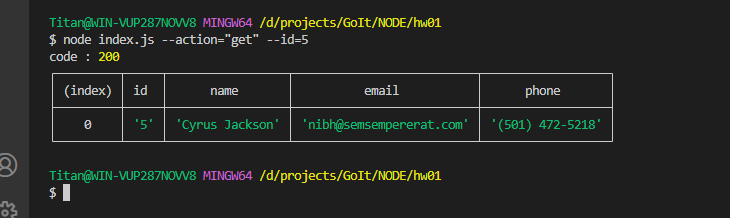

# HW01
# Скріншот результату виконання кожної команди.

 Отримуємо і виводимо весь список контактів у вигляді таблиці (console.table)
node index.js --action="list"

Отримуємо контакт по id
node index.js --action="get" --id=5

Додаємо контакт
node index.js --action="add" --name="Mango" --email="mango@gmail.com" --phone="322-22-22"

Видаляємо контакт
node index.js --action="remove" --id=3

